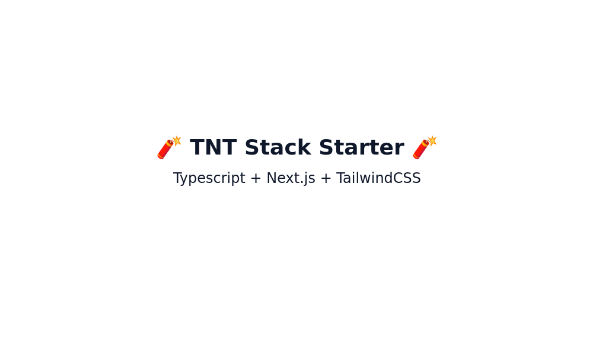

## 🧨 TNT Starter

> TypeScript + Next.js + TailwindCSS



### Getting Started

First, Clone the repository:

```bash
git clone https://github.com/mcnaveen/tnt
```

Then, install the dependencies:

```bash
npm install
# or
yarn
# or
pnpm install
```

Run the development server:

```bash
npm run dev
# or
yarn dev
# or
pnpm dev
```

Open [http://localhost:3000](http://localhost:3000) with your browser to see the result.

You can start editing the page by modifying `src/pages/index.tsx`. The page auto-updates as you edit the file.

[API routes](https://nextjs.org/docs/api-routes/introduction) can be accessed on [http://localhost:3000/api/hello](http://localhost:3000/api/hello). This endpoint can be edited in `src/pages/api/hello.ts`.

The `src/pages/api` directory is mapped to `/api/*`. Files in this directory are treated as [API routes](https://nextjs.org/docs/api-routes/introduction) instead of React pages.

### Dependencies

- @radix-ui/react-slot
- class-variance-authority
- clsx
- lucide-react
- next
- react
- react-dom
- tailwind-merge
- tailwindcss-animate

### Dev Dependencies

- @types/node
- @types/react
- @types/react-dom
- autoprefixer
- eslint
- eslint-config-next
- postcss
- tailwindcss
- typescript

## License

- MIT
